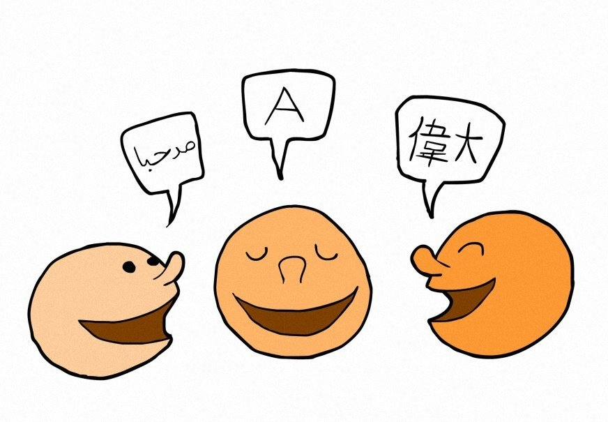
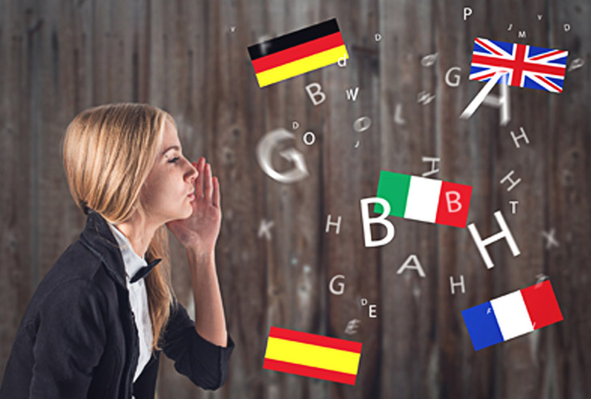
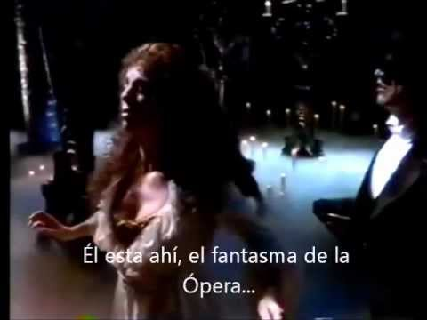

- **Traducción teatral**: contamos una plantilla de traductores expertos para la traducción de guiones teatrales
  
- **Interpretación**: ofrecemos servicios de interpretación para cualquier trámite que requiera.
   
- Ofrecemos **cursos de formación**. Además, tenemos convenio con la Universidad de Granada, de manera que muchos de sus estudiantes pueden realizar prácticas en nuestra empresa
   
- **Patrocinio de proyectos**
   
- **Intermediación**: ofrecemos este servicio estrechamente ligado con el de la interpretación para hacer los proyectos lo más sencillos posibles,  de forma que que los clientes puedan delegar en nosotros la mayor parte del proyecto
   
- **Sobretitulado**
                   
- **Subtitulación de películas**
  .jpg) 
- **Accesibilidad**: realizamos subtitulaciones para personas con discapacidad auditiva
   

